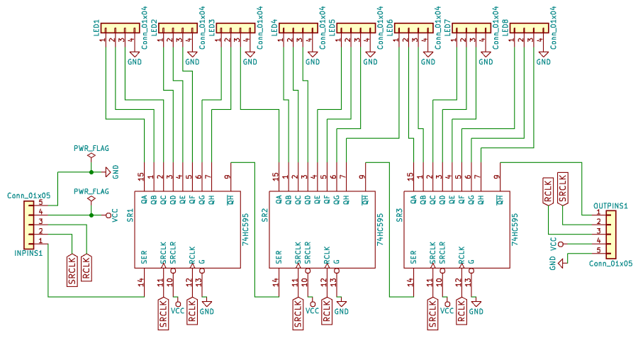

# bam-rgb-74hc595
An arduino sketch implementing bit angle modulation (BAM) for controlling 8 RGB
LEDs through 3 74hc595 shift registers.

## Schematic

## License
See the [LICENSE](LICENSE.md) file for license rights and limitations (MIT).
